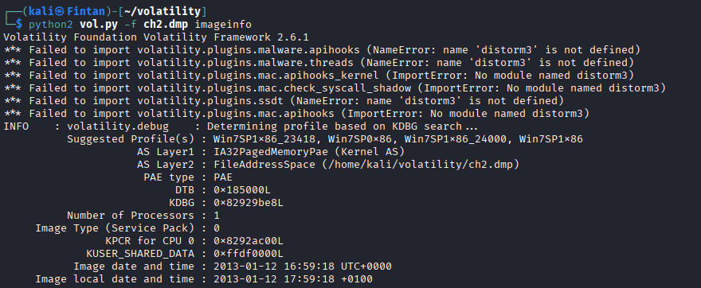
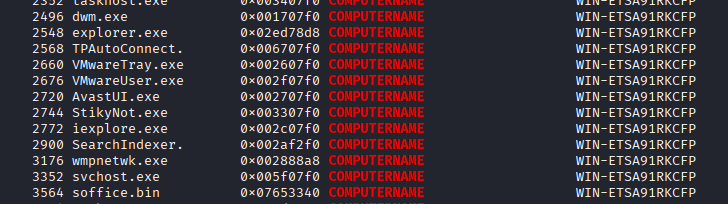

# Command & Control - level 2
1. xem thông tin về hệ điều hành 



- Hệ điều hành win7 ta sẽ lấy profile là Win7SP1x86
2. xem thông tin về hostname bằng
 ```
 python2 vol.py -f ch2.dmp --profile=Win7SP1x86 envars | grep COMPUTERNAME
```


Flag: WIN-ETSA91RKCFP