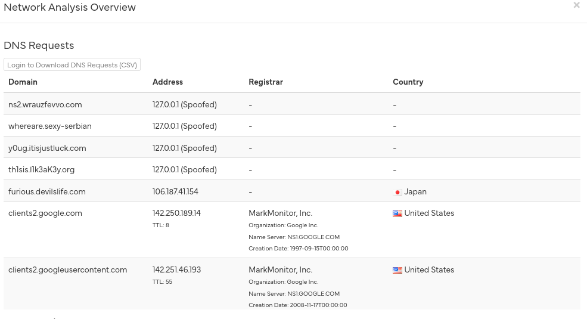

# Command & Control -level  5
Berthier, before blocking any of the malware’s traffic on our firewalls, we need to make sure we found all its C&C. This will let us know if there are other infected hosts on our network and be certain we’ve locked the attackers out. That’s it Berthier, we’re almost there, reverse this malware!

The validation password is a fully qualified domain name : hote.domaine.tld
## Solution

Ở các challenge trước ta đã thấy pid 2772 iexplore có những kết nối mạng ra ngoài đáng nghi ta sẽ dump file đó .exe đó ra để phân tích 

```
python2 vol.py -f ch2.dmp --profile=Win7SP1x86 procdump -p 2772 -D ./
```

Đưa lên [hybrid-analyst](https://hybrid-analysis.com) để phân tích và ta đã có được tên miền mà máy chủ đã gọi ra ngoài 



Thử từng cái và ta có được đáp án là th1sis.l1k3aK3y.org
