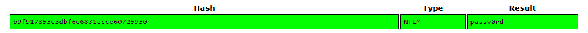

# Command & Control -level  5
Berthier, the malware seems to be manually maintened on the workstations. Therefore it’s likely that the hackers have found all of the computers’ passwords.
Since ACME’s computer fleet seems to be up to date, it’s probably only due to password weakness. John, the system administrator doesn’t believe you. Prove him wrong!

Find john password.
## Solution
Tất cả các mật khẩu của window đề được lưu vào trong file SAM và được mã hóa ta sẽ dùng lệnh hashdump để lôi tất cả những mật khẩu đó ra
```
Administrator:500:aad3b435b51404eeaad3b435b51404ee:31d6cfe0d16ae931b73c59d7e0c089c0:::
Guest:501:aad3b435b51404eeaad3b435b51404ee:31d6cfe0d16ae931b73c59d7e0c089c0:::
John Doe:1000:aad3b435b51404eeaad3b435b51404ee:b9f917853e3dbf6e6831ecce60725930
```
Đem đi giải mã



ta có password là: passw0rd

