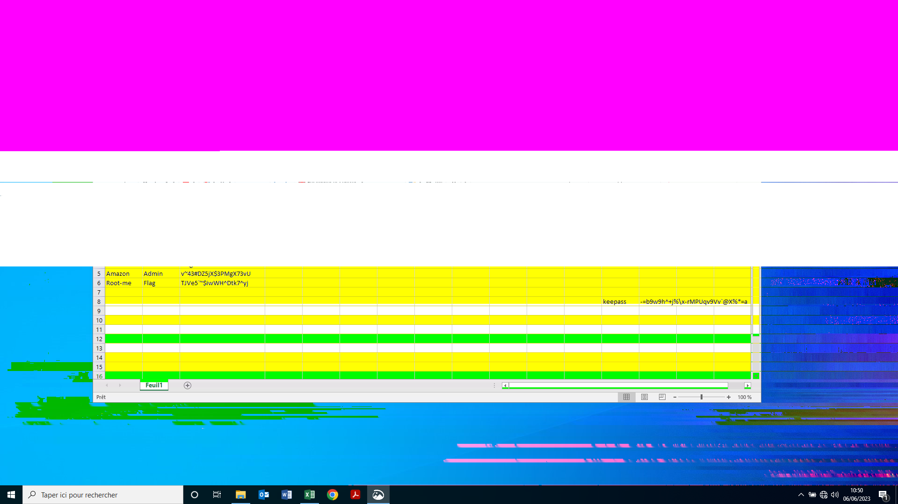

# cature this
[Link challenge](https://www.root-me.org/en/Challenges/Forensic/Capture-this)

title: An employee has lost his Keepass password. He couldn’t remember it, and couldn’t find his password file. After hours of searching, it turns out that he has sent a screen of his passwords to one of his colleagues, but it’s still nowhere to be found.

He’s asking for your help to find him.
It’s up to you

1. Khi tải về và giải nén ta được 2 file, 1 file là ảnh lưu mật khẩu và 1 file kbdx dùng để lưu mật khẩu, mục tiêu của chúng ta sẽ tìm mật khẩu để có thể vào được cơ sở dữ liệu này 
2. Thử mật khẩu

- Thử từng mật khẩu ở đây nhưng có vẻ nó không có mật khẩu nào đúng 
- Quan sát kĩ hơn sẽ thấy một chữ K ở giữa bên phải của màn hình excel nầy có lẽ nó là viết tắt của keepass, và nhìn xuống thanh taskbar ta thấy được đây là màn hình bị cắt bơi snipping tool
- Tìm lỗ hổng này trên mạng thì có một CVE về nó [CVE](https://msrc.microsoft.com/update-guide/vulnerability/CVE-2023-28303)
- Cụ thể lỗ  hổng này nói rằng nếu cắt ảnh bằng snipping tool dữ liệu bị cắt không mất đi mà vẫn còn nằm ở đó(giống như lấy một tấm nền đen để che vào dữ liệu đã cắt ), vì thế ta sẽ đi khôi phục lại tấm ảnh này 
- Sử dụng [tool](https://github.com/frankthetank-music/Acropalypse-Multi-Tool) để có thể khôi phục 

Flag: -=b9w9h^+j%\x-rMPUqv9Vv`@X%*=a
