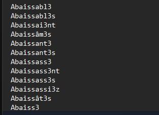
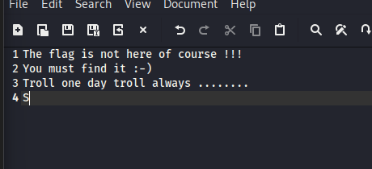

# Find me again
### Link tải file tại challenge Find me again root-me 
Ta có 2 file là forensics.img và file memory.raw
Chúng ta cần mật khẩu để có thể mở file forensics.img nên đầu tiên sẽ tìm mật khẩu đó ở trong memory.raw bằng tool aeskeyfind
```
┌──(kali㉿Fintan)-[/mnt/…/Foren/find me again/ch19/backup]

└─$ fls forensic.img 

Encryption detected (LUKS)
```
Lệnh này sẽ quét file bộ nhớ để tiofm các cấu trúc khóa AES vì LUKS sử dụng chuẩn má hóa AES
```
┌──(kali㉿Fintan)-[/mnt/…/Foren/find me again/ch19/backup]
└─$ aeskeyfind memory.raw
8d3f527de514872f595908958dbc0ed1
Keyfind progress: 100%
```
Ta dùng cryptsetup để ánh xạ file image thành một thiết bị có thể độc được và đặt tên cho nó, sau đó dùng fls và icat để lấy ra những file có liên quan
```
┌──(kali㉿Fintan)-[/mnt/…/Foren/find me again/ch19/backup]

└─$ sudo fls -r /dev/mapper/decrypted_volume

d/d 11: lost+found
d/d 2049:       dir1
+ r/r 2050:     dic_fr_l33t.txt
d/d 2051:       dir2
+ r/r 2052:     readme.txt
+ r/r 2053:     end.png
+ r/r 2054:     findme.txt.gpg
V/V 6145:       $OrphanFiles
```
Ta sẽ lấy những file như dic_fr_l33t.txt, readme.txt, end.png, findme.txt.gpg
Xem sơ qua toàn bộ file này 
1. File dic_fr_l33t.txt 
File này có vẻ như là mật khẩu để ta brute force file findme.txt.gpg



2. File readme.txt 
Do you know GPG ? So just do it to decipher !!!
3. End.png 


File này có vẻ như là nó sẽ chứa flag nên sẽ khai thác file này đầu tiên
Dùng String để thăm dò, phát hiện cuối dòng có 1 dữ liệu đang ngờ là 
```
^7]!S
'y):
{[b5
fHXn
'~VS
g`fJ
end.zip.gpgUT
```
Nên đã dùng Binwalk -e để trích xuất file bị giấu trong ảnh này ra, sau khi trích xuất trong này tiếp tục có 1 file bị nén kiểu end.zip.gpg
4. File findme.txt.gpg
Sẽ tiến hành tìm mật khẩu cho các file GPG này 

Tiếp theo sẽ điều tra thêm thông tin từ file memory.raw
Đầu tiên ta sẽ xem file ram này là hệ điều hành gì 
```
└─$ python3 vol.py -f memory.raw banners
Volatility 3 Framework 2.28.0
Progress:  100.00               PDB scanning finished                      
Offset  Banner

0x1a000e0       Linux version 4.4.0-72-lowlatency (buildd@lcy01-17) (gcc version 5.4.0 20160609 (Ubuntu 5.4.0-6ubuntu1~16.04.4) ) #93-Ubuntu SMP PREEMPT Fri Mar 31 15:25:21 UTC 2017 (Ubuntu 4.4.0-72.93-lowlatency 4.4.49)
0x2100424       Linux version 4.4.0-72-lowlatency (buildd@lcy01-17) (gcc version 5.4.0 20160609 (Ubuntu 5.4.0-6ubuntu1~16.04.4) ) #93-Ubuntu SMP PREEMPT Fri Mar 31 15:25:21 UTC 2017 (Ubuntu 4.4.0-72.93-lowlatency 4.4.49)
```
Theo như hiển thị thì đây là linux version 4 ta sẽ tiến hành cài đặt và chạy linux.bash 
```
└─$ python3 vol.py -f memory.raw linux.bash
Volatility 3 Framework 2.28.0
Progress:  100.00               Stacking attempts finished                 
PID     Process CommandTime     Command

1229    bash    2017-04-14 07:58:36.000000 UTC  history 
1229    bash    2017-04-14 07:58:36.000000 UTC  apt-get install linux-image-4.4.0-72-lowlatency linux-headers-lowlatency
1229    bash    2017-04-14 07:58:36.000000 UTC  reboot
1229    bash    2017-04-14 07:58:36.000000 UTC  apt-get insta
1229    bash    2017-04-14 07:59:07.000000 UTC  history 
1229    bash    2017-05-05 12:04:44.000000 UTC  apt-get install lynx gnupg
1229    bash    2017-05-05 12:06:54.000000 UTC  nano /etc/fstab 
1229    bash    2017-05-05 12:06:58.000000 UTC  nano /etc/crypttab 
1229    bash    2017-05-05 12:07:08.000000 UTC  cd /mnt/
1229    bash    2017-05-05 12:07:29.000000 UTC  cp -R /media/sf_DUMP/dir* .
1229    bash    2017-05-05 12:07:38.000000 UTC  ping 8.8.8.8
1229    bash    2017-05-05 12:09:14.000000 UTC  gpg --quick-gen-key 'Troll <abuse@root-me.org>' rsa4096 cert 1y
1229    bash    2017-05-05 12:09:49.000000 UTC  lynx -accept_all_cookies "https://www.google.com/?=password+porno+collection"
1229    bash    2017-05-05 12:10:27.000000 UTC  gpg --yes --batch --passphrase=1m_4n_4dul7_n0w -c findme.txt
1229    bash    2017-05-05 12:10:37.000000 UTC  lynx -accept_all_cookies "https://www.google.com/?=password+troll+memes"
1229    bash    2017-05-05 12:11:04.000000 UTC  gpg --yes --batch --passphrase=Troll_Tr0ll_TrOll -c end.zip
1229    bash    2017-05-05 12:11:20.000000 UTC  nano dir1/dic_fr_l33t.txt 
1229    bash    2017-05-05 12:11:28.000000 UTC  rm findme.txt
1229    bash    2017-05-05 12:11:35.000000 UTC  rm -rf dir1/
1229    bash    2017-05-05 12:11:55.000000 UTC  dd if=/dev/sdb of=/media/sf_DUMP/forensic.img bs=2048
```
Có thể quan sát được rằng các file findme và end đã được mã hóa bởi mật khẩu 1m_4n_4dul7_n0w và Troll_Tr0ll_TrOll ta sẽ dùng 2 mật khẩu này để giải mã 

Đầu tiên giải mã findme thì ở đây là một file fake flag

Tiếp theo giải mã find end.zip.gpg thì bên trong lại là 1 file zip chứa mật khẩu, ta sẽ dùng file dic_fr_l33t.txt để brute force mật khẩu file này và ta đã có kết quả
```
┌──(kali㉿Fintan)-[/mnt/…/find me again/ch19/backup/_end.png.extracted]
└─$ fcrackzip -u -D -p ../dir_fr.txt end.zip


PASSWORD FOUND!!!!: pw == Cyb3rs3curit3
```
Trong file zip này có một mã QR liên tục thay đổi, vì không thẻ quét từng mã QR nên sẽ dùng tool zbarmg để tự động quét 
```
─$ zbarimg -q --raw flag.gif | tr -d '\n'                                                                    
The_flag_is:1_Lik3_F0r3nS1c_4nd_y0u?                                                ```                                                                                         