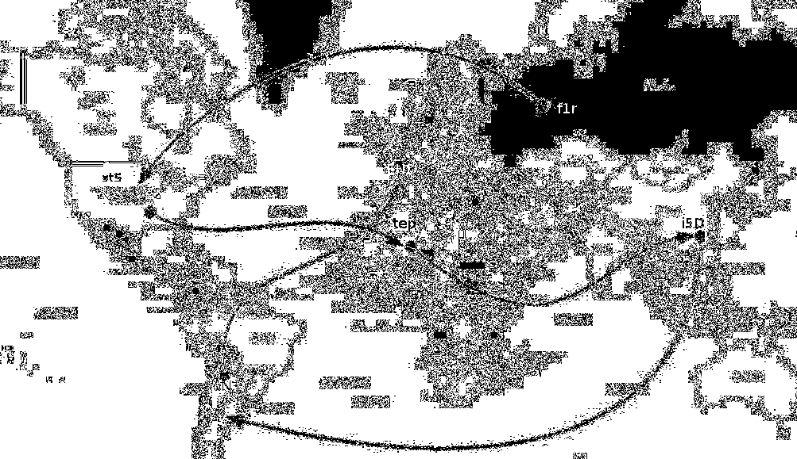

# Kitty spy

Challenge cho một ảnh với dung lượng 4mb, rất có thể có giấu dữ liệu gì đó bên trong, ta sẽ dùng binwalk để trích xuất dữ liệu ẩn này ra
```
1C61.zip   A838D.zip  step1      step2      step3      step4
A698D.zip  C49A4.zip  step1.zip  step2.zip  step3.zip  step4.zip
```
Gồm 4 step ta sẽ giải mã từng step 1-4 để tìm flag 
1. Giải mã step 1
File này cho ta 1 REad me và 1 file ảnh 
```
┌──(kali㉿Fintan)-[/mnt/…/Foren/kittyspy/_ch16.jpg.extracted/step1]
└─$ ls
README#1.txt  route.png
```
Dùng Strings và exiftool để xem password có giấu ở đây không 
```
└─$ exiftool route.png            
ExifTool Version Number         : 13.25
File Name                       : route.png
Directory                       : .
File Size                       : 675 kB
File Modification Date/Time     : 2017:08:08 12:32:40+07:00
File Access Date/Time           : 2026:03:28 23:30:15+07:00
File Inode Change Date/Time     : 2017:08:08 12:32:40+07:00
File Permissions                : -rwxrwxrwx
File Type                       : PNG
File Type Extension             : png
MIME Type                       : image/png
Image Width                     : 1195
Image Height                    : 688
Bit Depth                       : 8
Color Type                      : RGB
Compression                     : Deflate/Inflate
Filter                          : Adaptive
Interlace                       : Noninterlaced
Pixels Per Unit X               : 2835
Pixels Per Unit Y               : 2835
Pixel Units                     : meters
Comment                         : Hello you :) Just stay on the picture !!
Modify Date                     : 2017:08:07 11:36:27
Image Size                      : 1195x688
Megapixels                      : 0.822
```
Tại đây có dòng commnet nói rằng ta nên tập trung vào file hình ảnh nên hướng tiếp theo sẽ dùng stegsolve để soi từng bit

       

Sau khi soi và đi theo hướng muỗi tên ta có được password=f1rstSi5DoN3, dùng pass này để mở step 2

2. Giải mã step2 