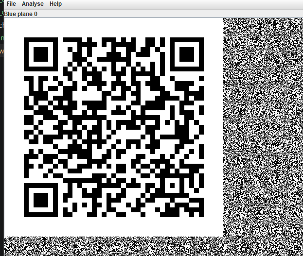

# Kitty spy

Challenge cho một ảnh với dung lượng 4mb, rất có thể có giấu dữ liệu gì đó bên trong, ta sẽ dùng binwalk để trích xuất dữ liệu ẩn này ra
```
1C61.zip   A838D.zip  step1      step2      step3      step4
A698D.zip  C49A4.zip  step1.zip  step2.zip  step3.zip  step4.zip
```
Gồm 4 step ta sẽ giải mã từng step 1-4 để tìm flag 
1. Giải mã step 1
File này cho ta 1 REad me và 1 file ảnh 
```
┌──(kali㉿Fintan)-[/mnt/…/Foren/kittyspy/_ch16.jpg.extracted/step1]
└─$ ls
README#1.txt  route.png
```
Dùng Strings và exiftool để xem password có giấu ở đây không 
```
└─$ exiftool route.png            
ExifTool Version Number         : 13.25
File Name                       : route.png
Directory                       : .
File Size                       : 675 kB
File Modification Date/Time     : 2017:08:08 12:32:40+07:00
File Access Date/Time           : 2026:03:28 23:30:15+07:00
File Inode Change Date/Time     : 2017:08:08 12:32:40+07:00
File Permissions                : -rwxrwxrwx
File Type                       : PNG
File Type Extension             : png
MIME Type                       : image/png
Image Width                     : 1195
Image Height                    : 688
Bit Depth                       : 8
Color Type                      : RGB
Compression                     : Deflate/Inflate
Filter                          : Adaptive
Interlace                       : Noninterlaced
Pixels Per Unit X               : 2835
Pixels Per Unit Y               : 2835
Pixel Units                     : meters
Comment                         : Hello you :) Just stay on the picture !!
Modify Date                     : 2017:08:07 11:36:27
Image Size                      : 1195x688
Megapixels                      : 0.822
```
Tại đây có dòng commnet nói rằng ta nên tập trung vào file hình ảnh nên hướng tiếp theo sẽ dùng stegsolve để soi từng bit

       

Sau khi soi và đi theo hướng muỗi tên ta có được password=f1rstStepi5DoN3, dùng pass này để mở step 2

2. Giải mã step2 
```
──(kali㉿Fintan)-[/mnt/…/kittyspy/_ch16.jpg.extracted/step2/step2]
└─$ ls
monster.wav  README#2.txt    
└─$ cat README\#2.txt 
Well ... Now that we know that, we must find the next step, we success to record a sound from his micro !
Maybe a trap to escape us ? I hope not ! We need to find how to use this sound, EVERYTHING can be a clue ...


Copyright © - 2017 - 18574115dbcd47d71e7eb9da74e45bf2

```
Cái mã này có vể như là pass vì nó gồm 32 kí tự ( có thể là mã băm md5 ) ta sẽ dùng cái mã băm này để trích xuất file ẩn trong file âm thanh ra 
18574115dbcd47d71e7eb9da74e45bf2 : meowmeowmeowmeow  md5
```
└─$ steghide extract -sf monster.wav  
Enter passphrase: 
wrote extracted data to "step2.txt".
└─$ cat step2.txt    
passw0rd=s3c0nDSt3pIsAls0D0n3             
```
3. Giải mã Step3 
```
┌──(kali㉿Fintan)-[/mnt/…/kittyspy/_ch161.jpg.extracted/step3/step3]
└─$ ls
README#3  suspected_website
                                                                                              
┌──(kali㉿Fintan)-[/mnt/…/kittyspy/_ch161.jpg.extracted/step3/step3]
└─$ cat README\#3
Wow ... Now we need to find what's hidden in this suspected website, we know that the guy get information from this site ...
BUt WhERe AnD HoW ?
```
Chữ BUt WhERe AnD HoW  này có vẻ như đặc biệt vì nó đôi lúc viết hoa và thường ta sẽ đi vào sâu hơn để điều tra tiếp 
```
└─$ ls
css  index.html  js  LICENSE.md  README.md
                                                                                              
┌──(kali㉿Fintan)-[/mnt/…/_ch161.jpg.extracted/step3/step3/suspected_website]
└─$ cat LICENSE.md 
Hello you :)
This can help you ... maybe not for this step but it could be useful for you :)
(Yes, I know, it's shit, it fuck my brain !)

++++++++++[>+>+++>+++++++>++++++++++<<<<-]>>>-----.>++++++++..<<++.>>+++++++++++++.----------.++++++.<<.>>-------.---------..-.<<.>>++++++++++++++++.-----.<<.>>----.+++.+.++++++++.<<.>>--------------.++++++++++.<<.>>+.------------.-------.+++++++++++++++++++.<<.>>+++++.----------.++++++.<<.>>++.--------------.+++..<<.>>----.-------.+++++++++++++++++++++.-----------------.<<.>>+++++++++++++++.-----.<<.>>---------.+++.+++++.----------.<<.>>---.<<.>++++++++++++++++.+.---------------.>++++++++++++++.-----------.+.<<.>>+++++++++++++++.-----.<<.>>-------.-------.+++++++++++++++++++++.-----------------.<<.>>+++++++++++++++.------------.---.<<.>>+.++++++.-----------.++++++.<<.+.


Don't say thank you ;)

```
File này có đoạn mã rất kì lạ, sau khi tìm hiểu thì nó là một kí tự của brainfuck sau khi giải mã All you need to know is that you will have to find a QRCode to have the flag !
Như gợi ý này thì bước tiếp theo ta sẽ tìm một mã code QR dưới dạng ảnh, nhưng không có một tấm ảnh nào 
```
──(kali㉿Fintan)-[/mnt/…/_ch161.jpg.extracted/step3/step3/suspected_website]
└─$ ls
css  index.html  js  LICENSE.md  README.md
                                                                                                             
┌──(kali㉿Fintan)-[/mnt/…/_ch161.jpg.extracted/step3/step3/suspected_website]
└─$ cat ind       
cat: ind: No such file or directory
                                                                                                             
┌──(kali㉿Fintan)-[/mnt/…/_ch161.jpg.extracted/step3/step3/suspected_website]
└─$ cat index.html 
```
Ta sẽ tiến hành xem index.html 
```
<!doctype html>
<HtmL>
<heaD>
        <MEta charset="utf-8">
        <MEta http-equiv="X-UA-Compatible" content="IE=edge">
        <Meta name="viewport" content="width=device-width, initial-scale=1.0">

        <lINK rel="shortcut icon" href="img/favicon.ico"> 
        <LiNk rel="stylesheet" href="css/vendor/fluidbox.min.css">
        <LiNK rel="stylesheet" href="css/main.css">

        <TiTlE>🐱 </TitLe>

</heAd>
<BODY>


        <heADer>

                <Div id="logo-container">
                        <dIV id="logo"><A href="/">🐱 Top Secret Website 🐱 </A></DiV>
                        <DiV id="subtitle">Cats only are authorized</DiV>
                </div>
<!--            <NAv>
                        <uL>
                                <lI><a href="#">Link 1</A></lI>
                                <LI><a href="#">Link 2</a></Li>
                                <LI><A href="#">Link 3</A></Li> 
                                <lI><A href="mailto:your@address.com" class="bordered">Contact</a></lI>
                        </uL>
                </Nav> -->

        </HEADer>

        <DiV id="content">

                <SEctiON class="intro">
                        <h1>Hello, <sPan class="nl"></sPaN>kitty !</H1>
                        <P>
StEg4n0gr4ph1e, The first recorded use of the term was in 1499 by Johannes Trithemius in his Steganographia, a treatise on cryptography and steganography, disguised as a book on magic. Generally, the hidden messages appear to be (or be part of) something else: images, articles, shopping lists, or some other cover text. For example, the hidden message may be in invisible ink between the visible lines of a private letter. Some implementations of steganography that lack a shared secret are forms of security through obscurity, and key-dependent steganographic schemes adhere to Kerckhoffs's principle.
                        </P>
                </SECTION>

                <SECTION class="row">
                        <DIV class="col-full">
                                <H2>You can stop now :)</H2>
                                <p>
You just have to know that the hidden message is not using numbers ! You have to skip them :)
                                </p>
                        </div>
                </section>

                <section class="row">
                        <div class="col">
                                <h2>Contact</h2>
                                <p>
        We only work with cats, so send a mail to Il0v3🐱 @cats.wonderful.amazing.meow
                                </p>
                        </div>
                        <div class="col">
                                <h2>Follow us</h2>
                                <p>
        It's a joke, do not follow any cat !
                                </p>
                        </div>
                </section>


                <section class="row">
                        <div class="col-full">
                                <p>
                                        © 2014 - This is a free website template by <a href="http://www.pixelsbyrick.com">Rick Waalders</a> -> This is true 🐱 
                                </p>
                        </div>
                </section>
 
        </div>

        <script src="//ajax.googleapis.com/ajax/libs/jquery/1.11.0/jquery.min.js"></script>
        <script>
        if (!window.jQuery) 
        {
            document.write('<script src="js/vendor/jquery.1.11.min.js"><\/script>');
        }
        </script>

        <script src="js/vendor/jquery.fluidbox.min.js"></script>
        <script src="js/main.js"></script>

        <script>
          (function(i,s,o,g,r,a,m){i['GoogleAnalyticsObject']=r;i[r]=i[r]||function(){
          (i[r].q=i[r].q||[]).push(arguments)},i[r].l=1*new Date();a=s.createElement(o),
          m=s.getElementsByTagName(o)[0];a.async=1;a.src=g;m.parentNode.insertBefore(a,m)
          })(window,document,'script','//www.google-analytics.com/analytics.js','ga');

          ga('create', 'YOUR_GOOGLE_ANALYTICS_ID', 'auto');
          ga('send', 'pageview');
          ## "Do you know the difference between a "C" and a "c" ? ... It could help you !"
        </script>

</body>
```
FIle này lại tiếp tục chữ hoa xen kẻ chữ thường và trong file HTML này tác giả đã gợi ý hãy phân biệt chữ hoa thường và bỏ qua các con số, theo gợi ý này ta sẽ xác định chữ hoa là bit 1 chữ thường là bit 0 sau đó chuyển các byte này thành ascii
```
with open('index.html', 'r', encoding='utf-8') as f:
    data = f.read()

# Lọc chỉ lấy các chữ cái A-Z, a-z
letters = ''.join([c for c in data if c.isalpha()])

# Chữ Hoa = 1, Chữ Thường = 0
binary_str = ''.join(['1' if c.isupper() else '0' for c in letters])

# Gom 8 bit thành 1 ký tự
decoded_message = ''
for i in range(0, len(binary_str) - len(binary_str)%8, 8):
    byte = binary_str[i:i+8]
    decoded_message += chr(int(byte, 2))

print(decoded_message)
```
8`À0@+"ó $6£("àÂ3Ï(▒Pt @ÿü
Ta thử đổi ngược lại hoa =0 và thường bằng 1 ta có được n3xTSt3pIsTh3L4stÿÿÿÿÿÿÿÿÿÿÿÿÿÿÿÿÿÿ
nhìn vào đây ta có thể kết luận password cho step4 là n3xTSt3pIsTh3L4st

4. Giải mã step4
```
┌──(kali㉿Fintan)-[/mnt/…/Foren/kittyspy/_ch16.jpg.extracted/step4]
└─$ ls
kitty.png  README#4.txt
```
Dựa theo hint của bài 3 là QR code LSB thì lầnn này ta sẽ không thử nhiều mà dùng stegsolve để lấy flag 




