# Forensics
## Cold Workspace
Title: A workstation in the design lab crashed during an overnight maintenance window. By morning, a critical desktop artifact was gone and the user swore they never touched it. You only have a memory snapshot from shortly before reboot. Recover what was lost.

1. Phân tích file
Chall cho 1 file dmp đây là file của bộ nhớ Ram, dùng vol để phân tích các thông tin của Ram
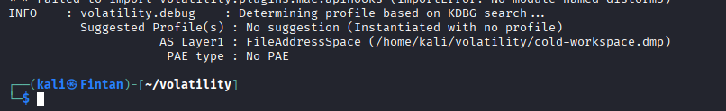
trong phần Suggested không thấy bất kì hệ điều hành nào khả dụng vì vậy không thể dùng vol để tiếp tục phân tích
2. chuyển hướng phân tích khác
- Dùng strings để đọc dữ liệu của file dmp này 
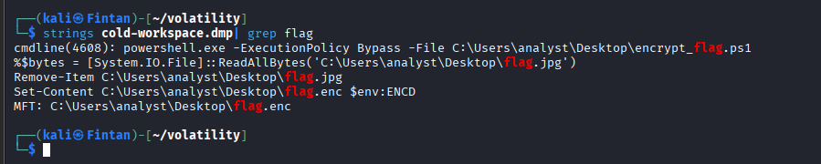
- Xuất hiện khá nhiều đường dẫn có liên quan đến flag, luồng hoạt động của chúng:
    - Chạy scirpt mã hóa flag 
    - Đọc flag 
    - Xóa file flag.jpg để che giấu 
    - Sau đó ghi dữ liệu được mã hóa vào biến môi trường ENCD, lưu vào file flag.enc
    - MFT ghi nhận rằng flag.enc đã được tạo 
- Tiếp tục tiềm kiếm trong biến môi trường ENCD
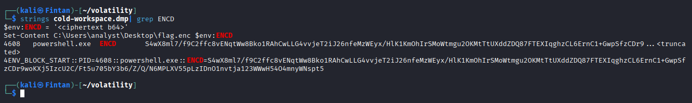

- có dữ liệu được mã hóa bằng base64, ta decode và lưu vào flag.bin
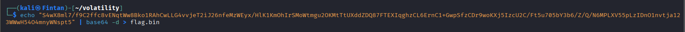
- đọc file (tất cả dữ liệu đã được mã hóa )

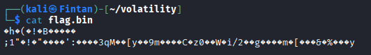
- Đọc 20 dòng từ dòng dữ liệu ReadAllBytes, ta biết được key được lưu trong biến môi trường ENCK, IV được lưu trong biến môi trường ENCV

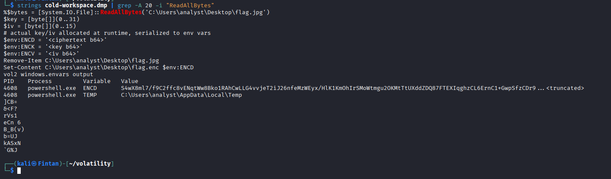
- Tìm key và IV 

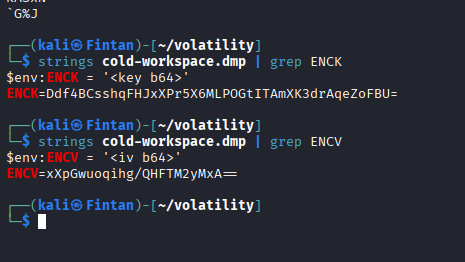
- Decode ta có được flag

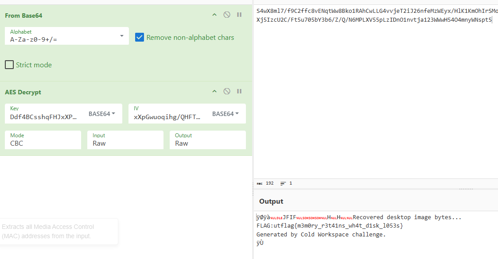

FLAG:utflag{m3m0ry_r3t41ns_wh4t_d1sk_l053s}

## Half Awake
Title: Our SOC captured suspicious traffic from a lab VM right before dawn. Most packets look like ordinary client chatter, but a few are pretending to be something they are not.

File này là file pcap chúng ta sẽ mở nó bằng wireshark
Sau khi điều tra ta tìm được hint như này 
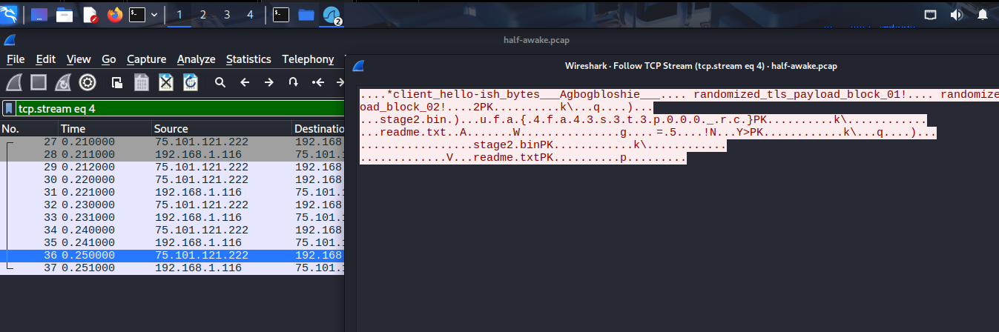

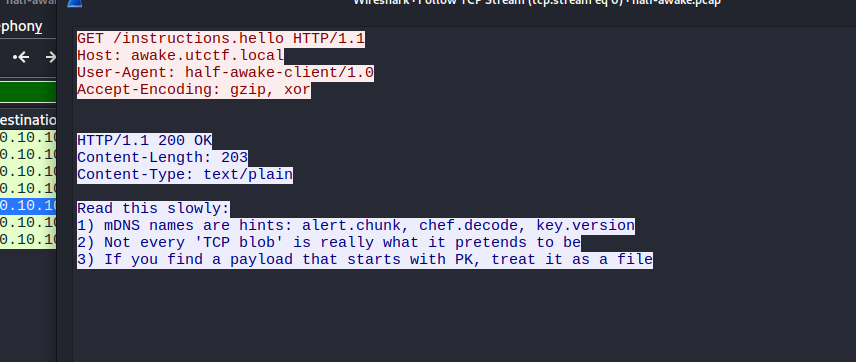

Điều này cho ta biết được payload được ngụy trang giống TLS traffic rồi đóng gói trong zip vì thế tiến hành trích xuất file zip trong file pcap này bằng binwalk 
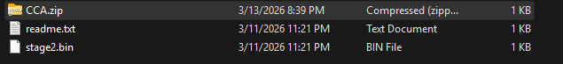


Có vẻ như dữ liệu trong file stage2.bin đã bị mã hóa XOR, ta sẽ tiếp tục tìm key để giải mã 
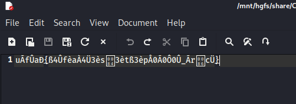

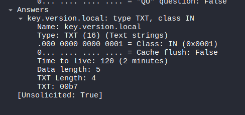

Tìm kiếm trong bản ghi mDNS mà đề bài đã gợi ý ta có được TXT  là 00b7, dùng nó để XOR với dữ liệu trong stage.bin ta có được flag 
vì sao biết 007b là key?
- vì với mọi kí tự khi XOR với 00 đều là chính nó ở đây ta có u.f.a... vì vậy ta chỉ cần lấy 7b đem XOR với các vị trí lẻ ta sẽ được flag

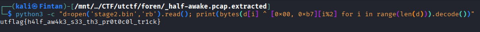

FLAG: utflag{h4lf_aw4k3_s33_th3_pr0t0c0l_tr1ck}

## Last Byte Standing
Title: A midnight network capture from a remote office was marked “routine” and archived without review. Hours later, incident response flagged it for one subtle anomaly that nobody could explain. Find what was missed and recover the flag.

Lại là 1 file pcap, ta mở bằng whireshark và phân tích 
xem qua 1 vòng file này thì chỉ có TCP fl của DNS là đáng nghi nhất khi gửi toàn dữ liệu phân mảnh thành các bit, đây là kĩ thuật phân mảnh để trốn tránh phát hiện qua mạng 

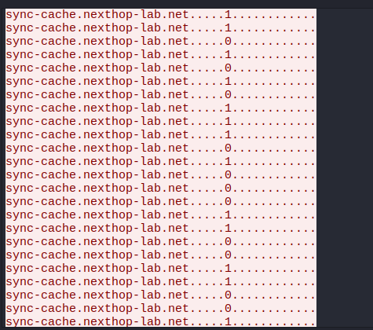 

Ghép tất cả các bit này lại 
01110101 01110100 01100110 11000110 00010011 10011101 11101101 10010001
10001100 01011001 11111011 10100001 10000101 11111101 00011010 00111001
11101110 11101110 10011011 11110100 11011011 11101000 10011110 01001111
00111011 11101000 11011111 11101101 11101000 11011011 11110111 1101

3 byte đầu có dạng utf nhưng đến byte thứ 4 thì không phải là chữ l, có thể là 1 phép dịch bit hoặc là XOR
Để từ 11000110 thành chữ l (01101100) khả quan nhất đó chính là dịch bit xoay vòng đến khi có nghĩa
Sau khi đổi:
01110101 01110100 01100110 01101100 01100001 01100111 01111011 01101110 00110000 01110100 01011111 01110100 01101000 01100001 01110100 01011111 01101000 00110100 01110010 01100100 01011111 01110010 00110001 01100111 01101000 01110100 01111101

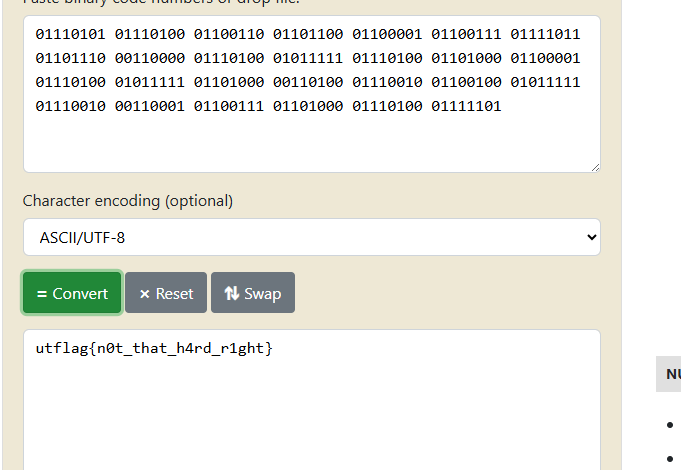

flag: utflag{n0t_that_h4rd_r1ght}

## Silent archive
title: Incident response recovered a damaged archive from an isolated workstation. The bundle split into two branches during transfer: one looks like duplicate camera captures, and the other is an absurdly deep archive chain.

Follow both trails, reconstruct the hidden message, and recover the token.

Tổng quát về file mà chall cho gồm 2 file :
- File thứ nhất gồm 2 picture giống nhau ( nhưng chưa chắc giống nhau hoàn toàn có thể khác nhau về pixel)
- File thứ 2 gồm 999.tar lồng nhau 

File thứ nhất 
- Xem chuỗi kí tự của mã nhị phân, tất cả đều giống nhau trừ trường AUTH_FRAGMENT_BASE64

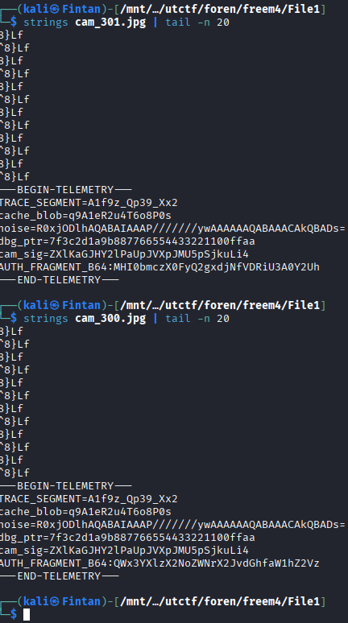

giả mã BASE 64 ta có 
Always_check_both_images
0r4ng3_ArCh1v3_T4bSp4ce!(đã thử và không phải flag )

File thứ hai
- Untar 999 file này ra 
```
#!/bin/bash

# Mật khẩu dự phòng (nếu gặp file RAR có pass)
PASS="0r4ng3_ArCh1v3_T4bSp4ce!"

echo "[*] Bắt đầu phá đảo chuỗi Archive lồng nhau..."

while true; do
    # 1. Tìm file nén bất kỳ trong thư mục hiện tại (.rar hoặc .tar)
    TARGET=$(ls *.rar *.tar 2>/dev/null | head -n 1)

    if [ -z "$TARGET" ]; then
        echo "[🌐] Không tìm thấy file nén nào nữa. Dừng lại tại đây!"
        ls -la
        break
    fi

    echo "[+] Đang xử lý: $TARGET"

    # 2. Kiểm tra định dạng và giải nén tương ứng
    if [[ "$TARGET" == *.tar ]]; then
        tar -xf "$TARGET" && rm "$TARGET"
    elif [[ "$TARGET" == *.rar ]]; then
        # Thử giải nén không pass, nếu lỗi thì dùng pass
        unrar e -y -p- "$TARGET" > /dev/null 2>&1 || unrar e -y -p"$PASS" "$TARGET" > /dev/null 2>&1
        rm "$TARGET"
    fi

    # Tránh vòng lặp vô tận nếu giải nén ra chính nó
    sleep 0.1
done

echo "[*] Hoàn tất! Nếu thấy file 'flag' hoặc '.txt', hãy 'cat' nó ra."
```
- Đến file cuối ta được file Noo.txt 

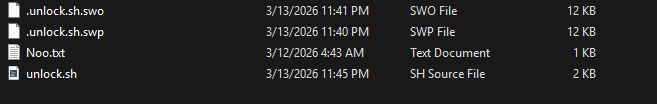

- Kiểm tra file, dữ liệu bên trong đã bị mã hóa, nhưng có hint đó là file Notaflag, tiến hành dùng binwalk để lấy file zip trong Noo.txt

 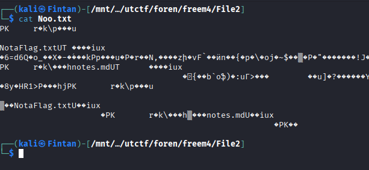

- Kiểm tra Noo.txt thì không có dữ liệu trong này ?
- Chuyển file này sang hex bằng xxd

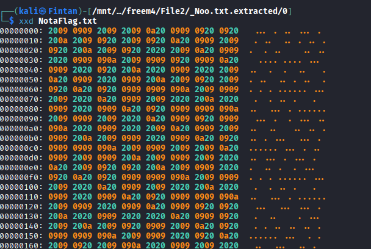

- các byte liên tục lặp lại là 20 và 09
- vì flag có dạng utflag với u có dạng bit 01110101 vì thế 20 có thể là bit 0, 09 là bit 1
- chuyển đổi tất cả ta có được flag
```
with open("NotaFlag.txt", "rb") as f:
    content = f.read()

binary_str = ""
for byte in content:
    if byte == 0x20: # Space
        binary_str += "0"
    elif byte == 0x09: # Tab
        binary_str += "1"
    elif byte == 0x0a: # Newline
        binary_str += " "


flag = "".join([chr(int(b, 2)) for b in binary_str.split() if b])
print(flag) 
```
flag:utflag{d1ff_th3_tw1ns_unt4r_th3_st0rm_r34d_th3_wh1t3sp4c3}


## Landfall
[Link file KAPE](https://drive.google.com/file/d/153Yg1Tv4ku8m4t-vkTekKiVdJE3ce6op/view?usp=drive_link)
Title: You are a DFIR investigator in charge of collecting and analyzing information from a recent breach at UTCTF LLC. The higher ups have sent us a triage of the incident. Can you read the briefing and solve your part of the case?

Chall này gồm 4 file ta cần tìm được password của checkpoint A.zip
Hint:
Hello operator, in the .zip file is a triage of the desktop breached by the 
threat actors. It seems like they were able to physically login, so we think 
there's an insider threat amongst the employees.

Checkpoint A: What command did the threat actor attempt to execute to 
obtain credentials for privilege escalation? 

Hint: The password to Checkpoint A is ONLY the encoded portion. The password
is MD5 hash of this portion.

File cần điều tra
Vì hint cho biết rằng kẻ tấn công đã lấy thông tin đăng nhập bằng lệnh nên ta sẽ tập trung vào lịch sử của powershell trong file ConsoleHost_history.txt

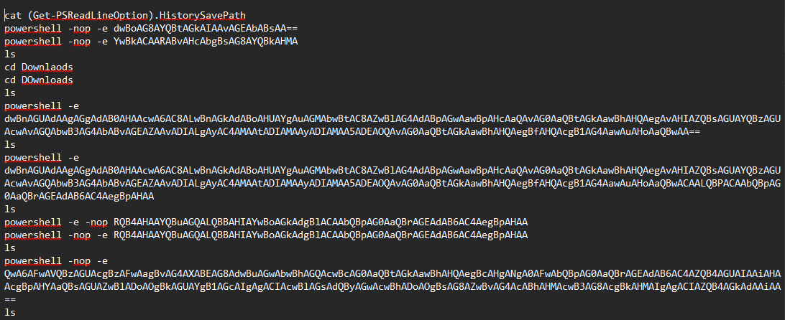

Luồng hoạt động 
1. whoami /all (Kiểm tra quyền hạn hiện tại)
2. Chuyển vào thư mục Downloads
3. Tải công cụ hack Mimikatz từ GitHub về máy.
4. Giải nén file mimikatz.zip
5. Dòng cuối cùng: Chạy mimikatz.exe với lệnh privilege::debug và sekurlsa::logonpasswords để trích xuất toàn bộ mật khẩu trong RAM của Windows!

chuyển dòng cuối sang MD5 ta có được pass
00c8e4a884db2d90b47a4c64f3aec1a4
giải nén checkpointA ta có được flag
Flag: utflag{4774ck3r5_h4v3_m4d3_l4ndf4ll}
## Watson
[Link file KAPE](https://drive.google.com/file/d/153Yg1Tv4ku8m4t-vkTekKiVdJE3ce6op/view?usp=drive_link)
Title: We need your help again agent. The threat actor was able to escalate privileges. We're in the process of containment and we want you to find a few things on the threat actor. The triage is the same as the one in "Landfall". Can you read the briefing and solve your part of the case?

Giống challenge trên nhưng lần này ta cần tìm pass cho cả 2 file zip 

hint: Welcome back agent. Please get us the following:

Checkpoint A: The threat actor deleted a word document containing secret 
project information. Can you retrieve it and submit the name of the project?

Checkpoint B: The threat actor installed a suspicious looking program that 
may or may not be benign. Retrieve the SHA1 Hash of the executable.

Hint: 
- Checkpoint A's password is strictly uppercase
- Checkpoint B's password is the SHA1 Hash

1. Tìm checkpointA 
Vì hint cho biết hacker đã xóa đi file chứa secret viết hoa nên ta sẽ đi khôi phục file đó, có thể cần tìm trong recycle.bin(folder chứa file đã xóa)

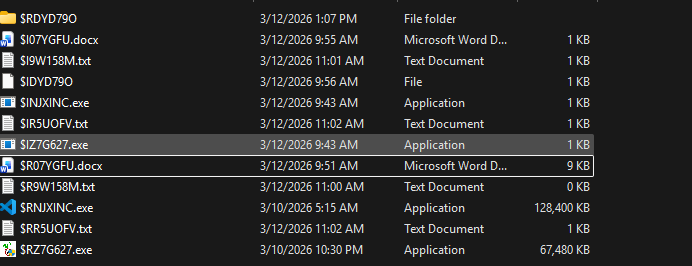

Mở file doc.x ta có 

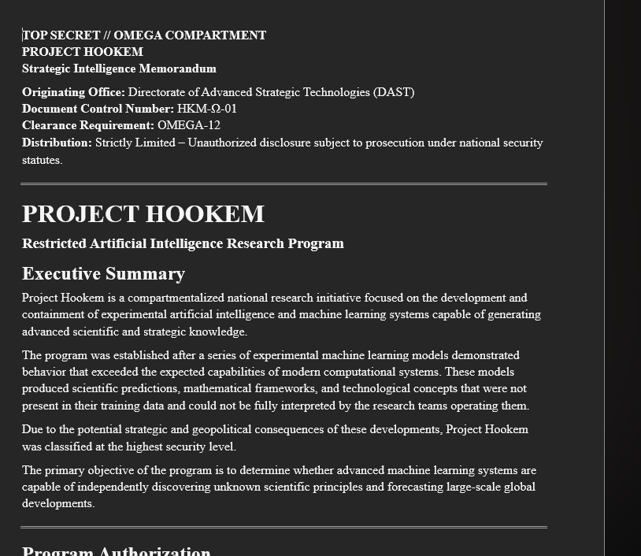

Thử password là HOOKEM ta có được checkpointA là:pr1v473_3y3
2. Tìm checkpointB
Tìm một mã băm của một phần mềm khả nghi( có thể vô hại hoặc không ) đã được hacker tải xuống 
Vì là ứng dụng nên sẽ có đuôi là .exe 
vì thế ta thử tìm các file .exe trong ổ c,tất cả file .exe đều nằm trong recycle.bin,ta sẽ trích xuất sha1 sau đó dò mật khẩu 

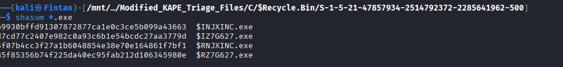

Không có mật khẩu nào đúng 

Tiếp tục điều tra thì có 2 nơi khả nghi đó là file prfetch và amcache trong ổ C của window
pretch: cho biết lịch sử thực thi của các ứng dụng 

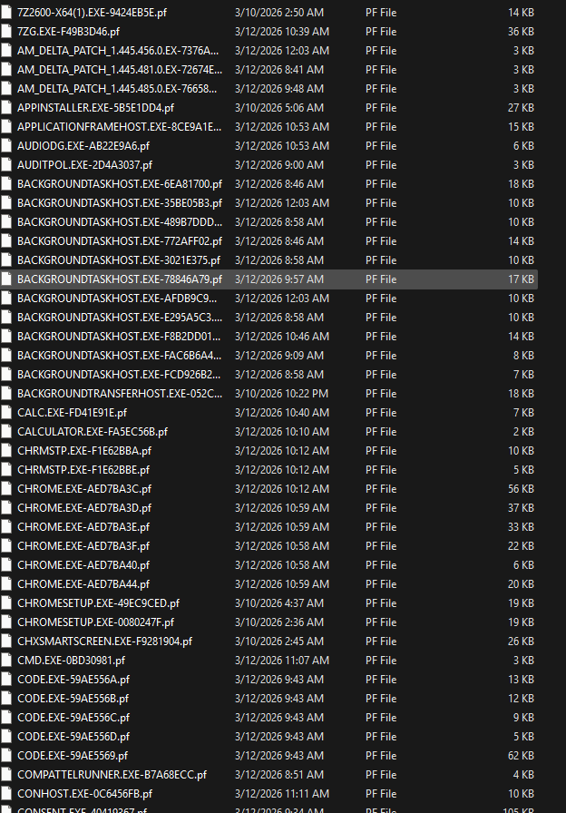

Amcache: tính toán mã băm của các ứng dụng được cài đặt hoặc thực thi 
Mở file prefetch vì ứng dụng có thể vô hại hoặc không nên ta brute-force mật khẩu ứng với các ứng dụng trong prefetch

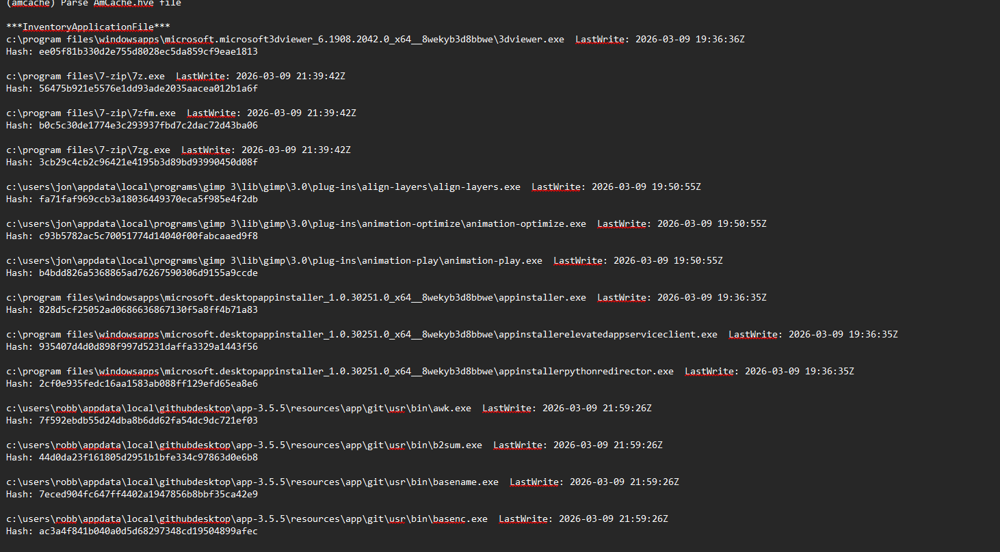

Trích xuất tất cả các mã băm trong Amcache ta được 1 danh sách chứa toàn mã băm sau đó brute-force

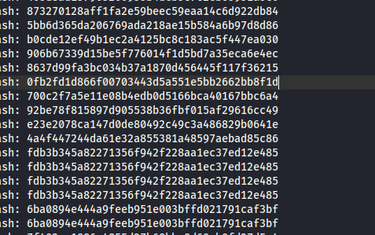

Viết python để tự động brute-force 
```
import zipfile, re

z = zipfile.ZipFile('CheckpointB.zip')
hashes = set(re.findall(r'\b[a-fA-F0-9]{40}\b', open('amcache_sha1_with_names.txt').read()))

for p in hashes:
    try:
        z.extractall(pwd=p.encode())
        print(f"Password: {p}")
        break
    except:
        pass
```
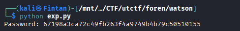

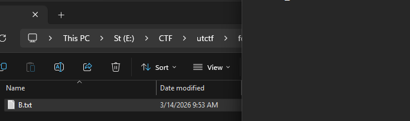

CheckpointB: m1551n6_l1nk
Flag: utflag{pr1v473_3y3-m1551n6_l1nk}